# 工作流和方法总结

## 1. 总体概述

在 Decision 项目中，我采用的是一套以产品验证为前置、以阶段门禁为控制、以高保真原型为实现基线、以自动化测试和视觉验收为闭环的研发工作流。

这套方法的核心不是尽快进入编码，而是先把问题定义、市场依据、用户路径、系统流程、交互原型和技术方案逐层收敛，再进入正式开发。每一阶段都有明确产物、确认口令和上下游影响检查，从而保证项目推进过程中需求、设计、技术实现和验收标准始终一致。

这套工作流体现了三点能力：

- 产品判断能力：先判断需求价值、目标用户、竞品差异和 ROI，再确定功能范围。
- 工程治理能力：用阶段状态、依赖追踪、版本记录和验收门禁控制复杂项目的变更风险。
- 交付闭环能力：将原型、代码、测试、截图和差异图串成可验证链路，避免只凭主观感觉判断完成度。

## 2. 我的核心工作流

### 2.1 需求澄清

项目从需求澄清开始，不直接进入实现。该阶段重点回答“为什么做、给谁做、做到什么边界”。我会先完成头脑风暴、市场调研、竞品分析和 ROI 预估，再沉淀最终功能清单。

这一阶段的产物包括：

- 需求澄清文档，明确问题背景、用户目标和产品边界。
- 市场调研文档，判断目标场景是否具备真实需求。
- 竞品分析文档，对比同类产品的能力结构和差异空间。
- ROI 预估文档，量化投入、收益、回收期和盈亏平衡条件。
- 功能清单，按 P0、P1、P2 区分本期核心闭环和后续增强能力。

### 2.2 产品设计

需求确认后进入产品设计阶段。该阶段不是一次性写完整方案，而是按子阶段逐步收敛：

1. 用户流程图：明确用户从创建任务到完成推演和查看报告的主流程及分支回退路径。
2. 系统流程图：明确系统架构、数据流转、Agent 推演和人机协同闭环。
3. 概念原型：用静态 HTML 快速表达页面清单和主要内容区域。
4. 产品需求文档：将需求、页面、流程、状态、规则和验收标准结构化。
5. 高保真原型：形成正式前端实现的唯一视觉基线。

这个阶段的核心原则是“先确认语义，再确认结构，最后确认视觉”。在高保真原型确认前，不写正式 React、FastAPI、数据库、Agent 编排、推演引擎或部署代码，避免在需求尚未稳定时产生高成本返工。

### 2.3 技术设计和实施计划

高保真原型确认后，进入技术设计阶段。该阶段重点把产品需求翻译为可实施的工程方案，包括系统架构、接口设计、数据模型、Agent 推演生命周期、状态管理、分支管理、报告生成和测试策略。

技术方案确认后才进入正式开发。这样可以保证后续代码不是零散堆叠，而是围绕已批准的架构、接口和任务拆分执行。

### 2.4 正式开发

正式开发阶段采用逐页、逐功能、逐验收的方式推进。前端开发必须严格以高保真原型为基线，按登录页、首页、配置页、调研页、工作台、报告页、知识库页、入口汇总页的顺序迁移。

每个页面都要求完成：

- 原型节点到 React 组件、数据字段和事件的映射。
- 功能级自动化测试。
- 原型截图、实现截图和差异图。
- 浏览器布局检查和用户确认。

这一做法保证了正式前端不是重新设计，而是对已确认原型的等价工程化迁移。

### 2.5 测试与验收

测试与验收是独立阶段，不用开发期测试替代最终验收。阶段 5 需要覆盖系统测试、回归测试、浏览器测试、性能测试、安全检查、部署验证和用户验收。

验收关注的不只是功能是否能跑通，还包括：

- 核心流程是否完整闭环。
- 页面是否与高保真原型一致。
- 数据和状态是否可追溯。
- 异常路径和回退路径是否可控。
- 实际收益是否能回到 ROI 假设中复核。

## 3. 核心方法论

### 3.1 阶段门禁

项目推进依赖明确的阶段门禁。每个阶段都有对应产物和确认口令，例如“需求澄清 OK”“PRD OK”“高保真原型 OK”“技术方案 OK”“开发完成 OK”。只有当前阶段被确认，才允许进入下一阶段。

这种方式降低了跨阶段返工风险，也让项目状态对团队和评审者都清晰可见。

### 3.2 状态单一来源

项目以 `docs/product/workflow-state.yaml` 作为当前阶段和确认状态的唯一依据。任何人查看该文件，都能知道当前项目处于哪个阶段、哪些产物已确认、下一步是什么、是否允许进入开发。

这避免了口头确认、聊天记录和实际文件状态之间出现不一致。

### 3.3 变更影响管理

每次修改需求、流程、原型、技术方案或实现前，都要检查上游依据和下游影响。项目通过 `docs/product/traceability.yaml` 维护产物依赖关系，并通过同步脚本扫描待确认变更。

发现关联影响时，不直接扩散修改，而是先列出：

- 哪些文件受到影响。
- 为什么受到影响。
- 建议同步哪些内容。
- 暂不同步会产生什么不一致风险。

只有同步范围确认后，才修改关联文件，并在完成后记录变更。

### 3.4 高保真原型即实现基线

高保真原型在本项目中不是视觉参考，而是正式前端的唯一实现基线。正式开发必须保持 DOM 层级、布局、尺寸、CSS、字体、颜色、间距和页面状态与原型等价。

React 组件化只改变代码组织方式，不能改变最终页面表现。这样可以把设计确认结果直接传递到工程实现中，减少“设计已确认、实现又变样”的常见问题。

### 3.5 最小实现原则

实现时只做当前阶段、当前页面、当前需求真正需要的内容。不额外开发未确认功能，不提前设计无用配置，不为了个人习惯重构周边代码。

每一行改动都要能对应到明确需求、测试或验收标准。这一点尤其适合复杂项目，因为复杂项目最容易因为“顺手优化”和“提前扩展”失控。

### 3.6 证据驱动验收

项目完成状态必须由证据支撑，而不是由主观判断支撑。证据包括：

- 自动化测试结果。
- 构建结果。
- 浏览器验证结果。
- 原型截图、实现截图和差异图。
- 用户确认记录。
- 变更记录和同步状态。

这种方式让项目交付结果可复查、可比较、可追溯。

## 4. 核心工作流流程图

```mermaid
flowchart LR
    A["需求澄清"] --> A1["头脑风暴"]
    A1 --> A2["市场调研"]
    A2 --> A3["竞品分析"]
    A3 --> A4["ROI 预估"]
    A4 --> A5["最终功能清单"]
    A5 --> G1{"需求澄清 OK?"}

    G1 -- "否" --> A
    G1 -- "是" --> B["产品设计"]

    B --> B1["用户流程图"]
    B1 --> G21{"用户流程 OK?"}
    G21 -- "否" --> B1
    G21 -- "是" --> B2["系统流程图"]

    B2 --> G22{"系统流程 OK?"}
    G22 -- "否" --> B2
    G22 -- "是" --> B3["概念原型"]

    B3 --> G23{"概念原型 OK?"}
    G23 -- "否" --> B3
    G23 -- "是" --> B4["产品需求文档"]

    B4 --> G24{"PRD OK?"}
    G24 -- "否" --> B4
    G24 -- "是" --> B5["高保真原型"]

    B5 --> G25{"高保真原型 OK?"}
    G25 -- "否" --> B5
    G25 -- "是" --> C["技术设计和实施计划"]

    C --> C1["系统架构"]
    C1 --> C2["接口与数据模型"]
    C2 --> C3["实施任务拆分"]
    C3 --> C4["测试策略和部署计划"]
    C4 --> G3{"技术方案 OK?"}

    G3 -- "否" --> C
    G3 -- "是" --> D["正式开发"]

    D --> D1["逐页等价迁移"]
    D1 --> D2["功能级自动化测试"]
    D2 --> D3["原型截图 / 实现截图 / 差异图"]
    D3 --> D4["用户逐页确认"]
    D4 --> G4{"开发完成 OK?"}

    G4 -- "否" --> D
    G4 -- "是" --> E["测试与验收"]

    E --> E1["系统测试"]
    E1 --> E2["回归与浏览器测试"]
    E2 --> E3["性能、安全、部署验证"]
    E3 --> E4["用户验收与 ROI 复核"]
    E4 --> G5{"测试验收 OK?"}

    G5 -- "否" --> E
    G5 -- "是" --> F["项目交付闭环"]

    X["变更影响管理"] -. "扫描 / 状态 / 验证 / 接受" .- A
    X -. "同步上下游产物" .- B
    X -. "控制技术和实现变更" .- C
    X -. "记录开发与验收证据" .- D
```



## 5. 与工作流匹配的文件夹结构

下面是这套工作流在项目中的文件组织方式。它不是简单的文件堆放，而是按“产品阶段产物、技术实施、正式代码、测试验证、展示材料”分层管理。

```text
MultiAgent/
├── AGENTS.md
│   └── 项目级工作规则、阶段门禁、变更控制和编码约束
├── docs/
│   ├── product/
│   │   ├── workflow-state.yaml
│   │   │   └── 当前阶段、确认状态和下一阶段的唯一状态来源
│   │   ├── traceability.yaml
│   │   │   └── 产品产物之间的依赖关系映射
│   │   ├── sync-status.yaml
│   │   │   └── 变更扫描后的待同步状态
│   │   ├── 变更记录.md
│   │   │   └── 每次同步和确认后的变更记录
│   │   ├── 一致性与变更追踪.md
│   │   │   └── 产物一致性和影响管理说明
│   │   ├── 00-需求澄清.md
│   │   ├── 01-市场调研.md
│   │   ├── 02-竞品分析.md
│   │   ├── 03-ROI预估.md
│   │   ├── 04-功能清单.md
│   │   │   └── 阶段 1：需求澄清和功能范围
│   │   ├── 05-用户流程图.excalidraw
│   │   ├── 06-系统流程图.excalidraw
│   │   ├── 07-概念原型.html
│   │   ├── 08-产品需求文档.md
│   │   ├── 09-高保真原型/
│   │   │   ├── login.html
│   │   │   ├── home.html
│   │   │   ├── config.html
│   │   │   ├── research.html
│   │   │   ├── workspace.html
│   │   │   ├── report.html
│   │   │   ├── knowledge.html
│   │   │   ├── src/
│   │   │   ├── verification/
│   │   │   ├── baseline-manifest.json
│   │   │   └── updatelog.md
│   │   │       └── 阶段 2：从流程、PRD 到高保真原型的正式设计产物
│   │   ├── 10-系统设计文档_v3.md
│   │   │   └── 阶段 3：技术架构、接口、数据模型和实施计划
│   │   └── 11-开发记录.md
│   │       └── 阶段 4：逐页开发、映射关系、测试结果和验收记录
│   └── superpowers/
│       └── plans/
│           └── 实施计划和阶段性开发计划
├── scripts/
│   ├── product-sync.mjs
│   ├── product-sync-state.mjs
│   ├── excalidraw-user-flow.mjs
│   └── install-product-sync-watcher.sh
│       └── 产品同步、状态扫描、流程图检查和监听器脚本
├── tests/
│   ├── product-sync-state.test.mjs
│   └── excalidraw-user-flow.test.mjs
│       └── 产品治理脚本和流程图规范的自动化测试
├── apps/
│   ├── web/
│   │   ├── src/
│   │   └── verification/
│   │       └── 正式前端代码、页面测试、原型截图、实现截图和差异图
│   └── api/
│       ├── app/
│       └── tests/
│           └── 后端 API、状态管理、推演逻辑和后端测试
├── data/
│   └── 运行数据和项目数据
├── config/
│   └── 项目配置
└── 成果展示/
    ├── demo录屏.mov
    └── 工作流和方法总结.md
        └── 展示材料，集中呈现工作流、方法论、流程图和文件结构
```


## 6. 总结

Decision 项目的工作方法可以概括为：

> 以产品价值判断为起点，以阶段产物确认为门禁，以高保真原型为实现基线，以变更追踪控制一致性，以自动化测试和视觉验收证明交付质量。

这套工作流适合复杂 AI 产品和多 Agent 系统，它能够解决需求不确定、交互复杂、技术链路长、验收难度高这四类风险问题。最终交付的不只是一个可运行系统，也是一套可复盘、可协作、可扩展的研发过程。
